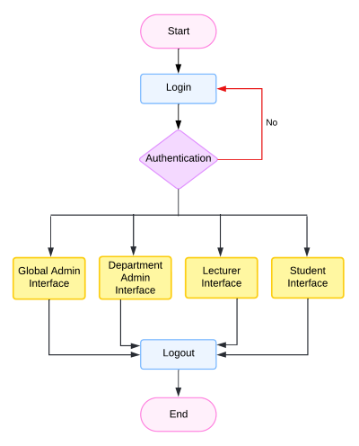
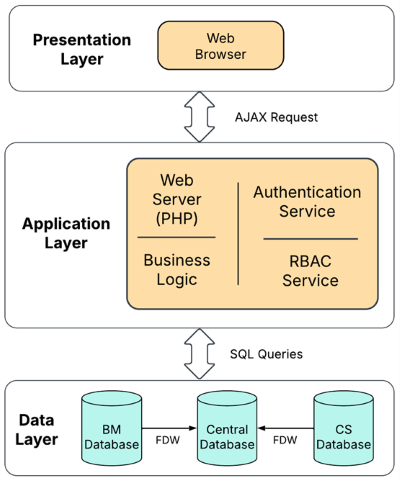
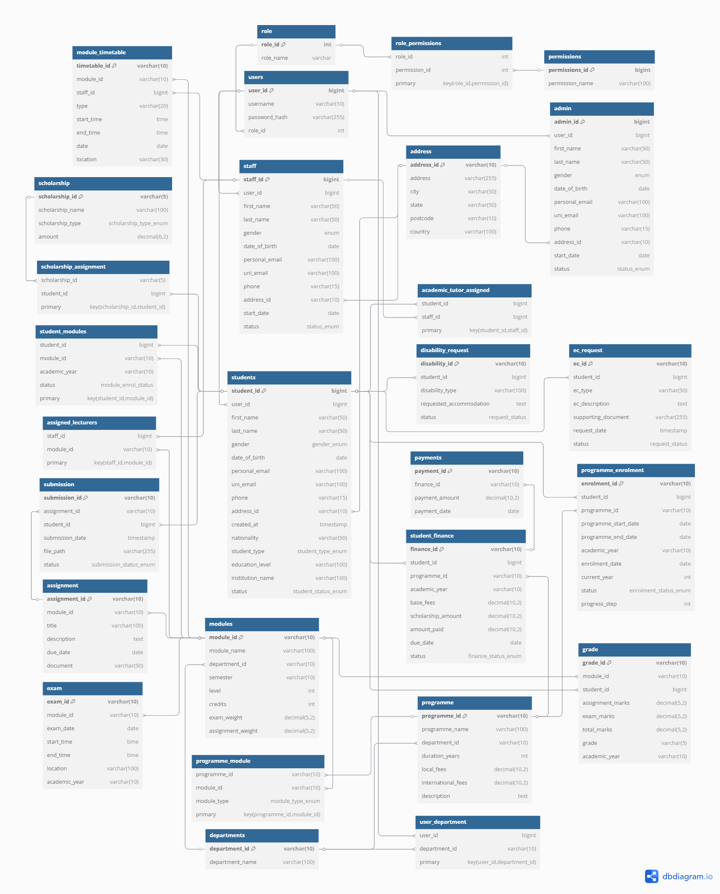
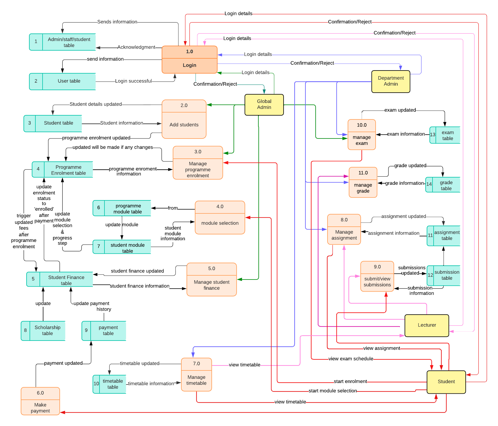
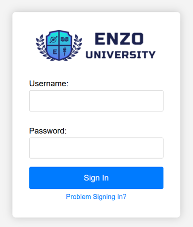
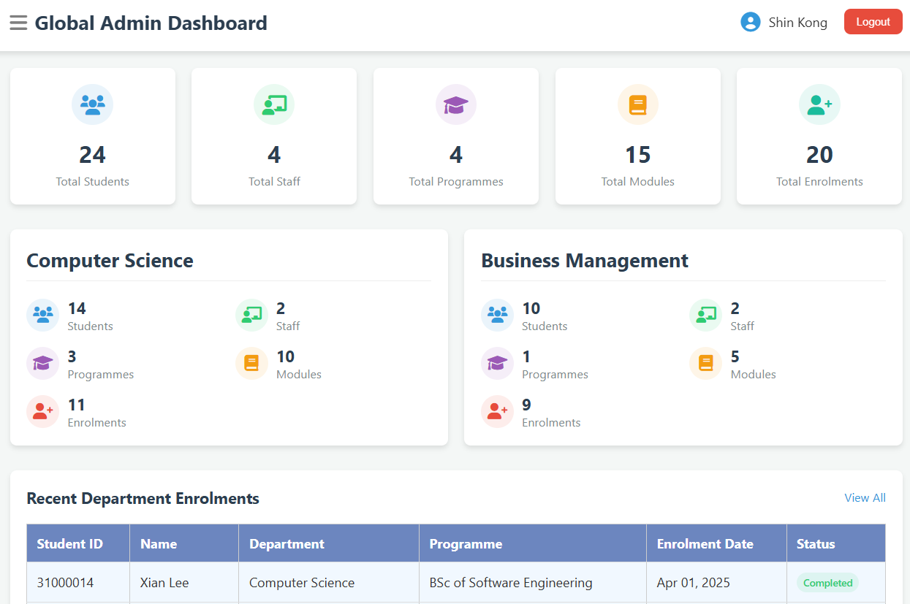

# Modular Student Information System

A **Modular Student Information System** (MSIS) designed to manage and streamline student-related data for educational institutions. This system is built with **PHP** for backend development, **HTML**, **CSS**, and **JavaScript** for frontend, and **PostgreSQL** as the database. The system uses **FDW** (Foreign Data Wrapper) to support a **distributed database** architecture (central + departmental databases).

## Features

- **User Authentication**: Secure login system for different actors (Admin, Faculty, Student, and Department).
- **Central and Departmental Databases**: Data is managed centrally while allowing departmental access through FDW.
- **Modular**: Flexible modules such as Student Management, Course Enrollment, Grades Management, and Attendance.
- **Real-time Data Access**: Easy access to real-time student data, reports, and statistics.
- **Responsive Interface**: User-friendly interface for students, faculties, and administrators.

## Flowchart


## System Architecture

The **Modular Student Information System** uses a distributed system architecture to manage student data both centrally and by department. Below is the architecture diagram showcasing the interaction between various components.



### Actors:
- **Admin**: Manages all aspects of the system (user roles, system settings, etc.).
- **Faculty**: Manages courses, grades, and attendance.
- **Student**: Views grades, attendance, and personal information.
- **Department**: Handles departmental-level data access using FDW.

## Database Architecture

The system uses **PostgreSQL** with **Foreign Data Wrapper (FDW)** support for managing data across a central database and multiple departmental databases. This ensures data consistency and easy access at both levels.

### ERD (Entity-Relationship Diagram)

The ERD shows the relationship between various entities in the system like Students, Courses, Departments, Grades, etc.



### Data Flow Diagram (DFD)

The DFD illustrates how data flows within the system from input to processing and output, including how different actors interact with the system.



## Installation

### Prerequisites

- **PHP** (version 7 or higher)
- **PostgreSQL** (version 12 or higher)
- Web server (e.g., Apache or Nginx)
- A modern web browser for frontend

### Steps to Set Up

1. **Clone the Repository**:
   ```bash
   git clone https://github.com/yourusername/modular-student-info-system.git
   ```

2. **Set Up PostgreSQL Database**:

   * Create the PostgreSQL databases for the central and departmental systems.
   * Use FDW to connect the departmental databases to the central one.
   * Import the database schema using:

     ```sql
     psql -U postgres -d your_database_name -f schema.sql
     ```

3. **Configure the Backend**:

   * Update the **config.php** file with your database credentials.
   * Ensure FDW connections are set up properly for distributed database support.

4. **Run the Application**:

   * Deploy the PHP files to your web server.
   * Access the system via your browser at `http://localhost/your-project-folder`.

## Screenshots

### Login Page



### Dashboard (Admin View)



### Dashboad (Student View)


## Technologies Used

* **Backend**: PHP
* **Frontend**: HTML, CSS, JavaScript
* **Database**: PostgreSQL with FDW (Foreign Data Wrapper)
* **Web Server**: Apache

## Contributions

Feel free to contribute to this project by submitting issues, suggestions, or pull requests. Contributions are welcome!


